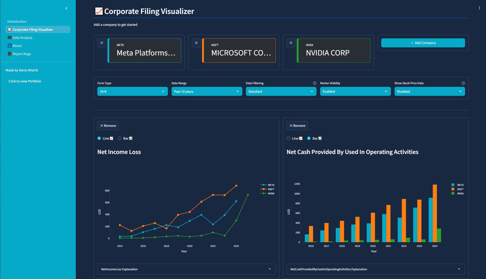
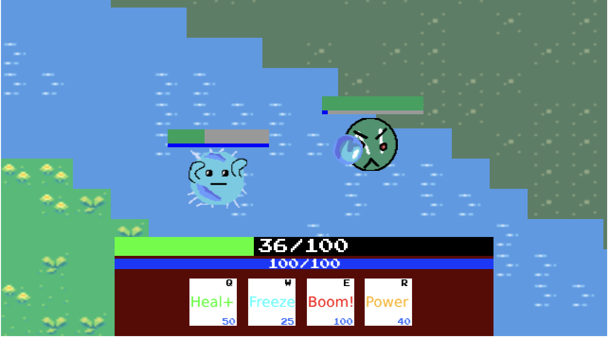
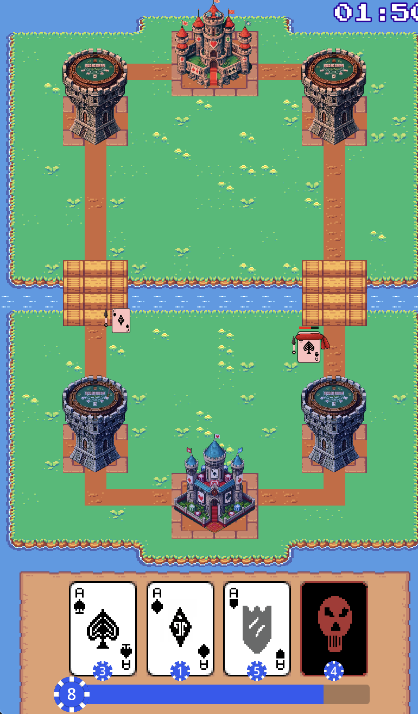
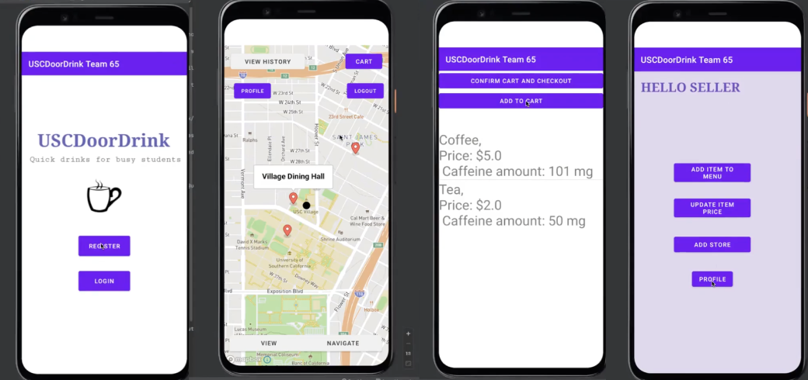
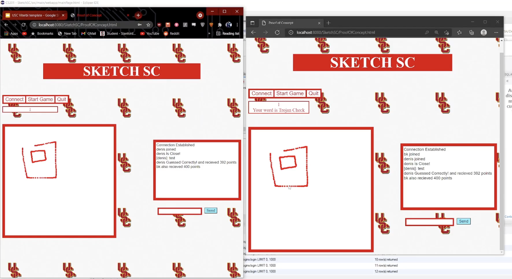

## Portfolio

---

### Filings Visualized

A full-stack comprehensive graphing, visualization, and data analysis tool for SEC corporate filings. Includes the ability to create your own custom dashboard of SEC data, from all available years, and have up to 5 companies compared at one time in a Google trends style view. 

Additionally you can perform aggregate data science with PCA dimension reduction and HDBSCAN clustering.

Runs on its own dedicated VPS with a custom SQL database I populated from raw SEC EDGAR data. 

Available at <a href="https://filingsvisualized.com/">[filingsvisualized.com]</a>

---

### Visual maze solver Genetic Algorithm 

This python library utilizes tkinter to create a GUI and a canvas to visualize how a simple genetic algorithm would traverse a specific maze. Comes with various customizable variables, such as mutation rate, generation size, sequence length etc. Once the algorithm successfully reaches its goal node, the user will be prompted with the ability to graph various statistics relating to the genetic algorithm.

<a href="https://github.com/DenisMistrikUSC/PythonGeneticAlgorithmMaze">Repository Link</a> 

---
### 1v1 Moba Style Game with ChatGPT Integration

This game features the standard midlane setup found in games such as Dota 2 or League of Legends.
The player has 4 unique abilities to choose from and has to face an AI that uses advanced heuristics which 
are weighted by ChatGPT API calls and its game state analysis

<a href="https://mistrik.itch.io/mobagpt">[PLAY HERE]</a>

---

### Clash Royale Style card game battler with ChatGPT Integration

This game features two lanes with two towers and a base, the player is given a deck of poker themed cards that they 
can place on the battlefield that will then battle it out with the enemy

Implemented custom flow field logic for navigation to ensure performance and consistency.

Integrated a ChatGPT AI enemy, which is prompted with the game state and will decide what units to place if it has the resources for it

<a href="https://mistrik.itch.io/card-battler-with-chatgpt-enemy">[PLAY HERE]</a>

---

### Map Based Delivery Concept

Android application replicating the functionality of a food delivery app such as DoorDash or Uber eats. It can track a persons profile, their daily caffeine intake, give recommendations, and can give an expected delivery time in addition to visually showing the route taken. Created using Android Studio (Java) with a Firebase backend and the MapBox API for the mapping/directions.

<a href="https://github.com/DenisMistrikUSC/MapBasedDeliveryApp">Repository Link</a> 

---

### Web Based Pictionary

Web based version of pictionary, where the players can all join a singular chat room with one person acting as the
drawer and rest guessers. 

Implemented using Apache TomCat, basic html frontend with p5.js integration, and a java backend

<a href="https://github.com/DenisMistrikUSC/Personal/tree/main/SketchSC">Repository Link</a> 

<a href="https://drive.google.com/file/d/1nUVJBlB4Cgj1-LECoIpvSNTAdJpHIf1b/view?usp=sharing">Demonstration Video Link</a> 

